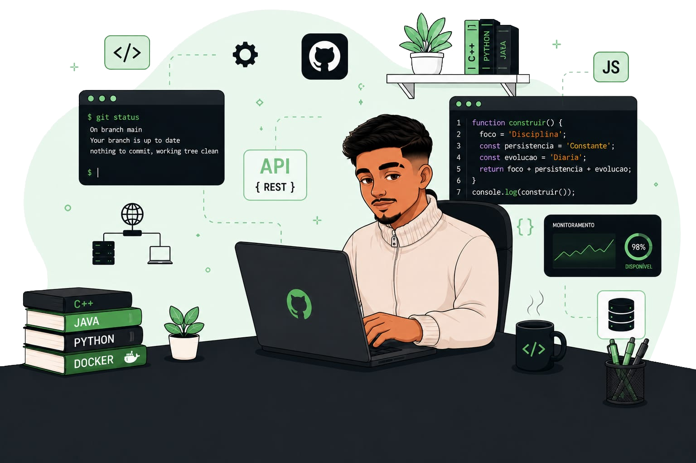

 
     

### 💫 Sobre Mim:

---

### 👨‍💻 Desenvolvedor Full Stack Júnior

Desenvolvedor em formação, com foco em aplicações web, sistemas de gerenciamento, bancos de dados e automação de processos, participando de projetos desde a modelagem até a implementação.

🎯 Atualmente aprimorando conhecimentos em linguagens de programação, desenvolvimento de software e arquitetura de sistemas.

### 🌐 Social-Media:

 

---

### 💻 Tecnologias:

---

### 📊 GitHub Stats:

  
  

<picture align="center">
  <source media="(prefers-color-scheme: dark)" srcset="https://raw.githubusercontent.com/KaioAmim/KaioAmim/output/github-contribution-grid-snake-dark.svg">
  <source media="(prefers-color-scheme: light)" srcset="https://raw.githubusercontent.com/KaioAmim/KaioAmim/output/github-contribution-grid-snake-dark.svg">
  
</picture>

<!-- Proudly created with GPRM ( https://gprm.itsvg.in ) -->
